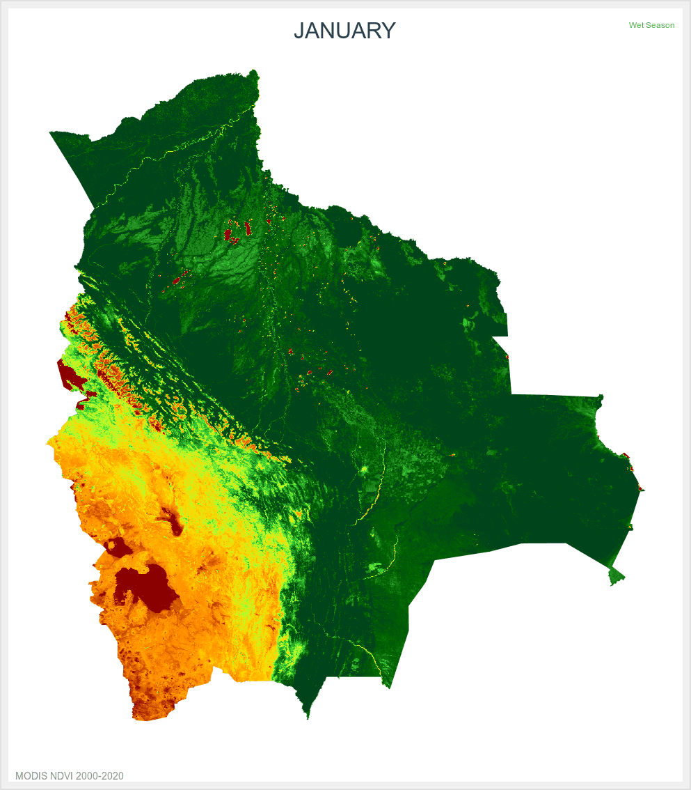

# 🇧🇴 Bolivia NDVI Time Series Animation

[](https://opensource.org/licenses/MIT)
[](https://earthengine.google.com/)
[](https://modis.gsfc.nasa.gov/)

An interactive animation showing **monthly vegetation health (NDVI)** across Bolivia from 2000-2020 using MODIS satellite data.

## 🎬 Animation Preview



## 🌍 Interactive Web Viewer

<iframe src="index.html" width="100%" height="550px" style="border: 2px solid #2D9B2E; border-radius: 10px;"></iframe>

## 📊 What is NDVI?

NDVI (Normalized Difference Vegetation Index) measures vegetation health using satellite imagery:

| NDVI Range | Vegetation Status |
|------------|-------------------|
| < 0.1 | Barren land, Altiplano |
| 0.2 - 0.4 | Sparse vegetation, dry grasslands |
| 0.4 - 0.6 | Moderate vegetation, crops |
| 0.6 - 0.8 | Dense vegetation, forests |
| > 0.8 | Very dense rainforest |

## 🎯 Features

- ✅ 12 monthly frames (January-December)
- ✅ Wet/Dry season indicators
- ✅ Interactive controls (play, pause, navigate)
- ✅ Keyboard shortcuts (Space, Arrow keys)
- ✅ Auto-playing animation

## 🚀 How to Run Locally

```bash
git clone https://github.com/zafariabbas68/Bolivia-NDVI-Time-Series-Animation.git
cd Bolivia-NDVI-Time-Series-Animation
open index.html
📁 Project Structure

text
Bolivia-NDVI-Time-Series-Animation/
├── index.html                      # Interactive web viewer
├── bolivia_ndvi_clean_fixed.gif    # Main animated GIF
├── annotated_clean/                # Individual monthly frames
│   ├── clean_01.png to clean_12.png
└── README.md
🌐 Live Demo

👉 View Live Interactive Map

📊 Data Source

Satellite: NASA MODIS (MOD13A2)
Period: 2000-2020
Resolution: 1km per pixel
Processing: Google Earth Engine
📧 Contact

Developer: Abbas Zafari

GitHub: @zafariabbas68
Project Link: https://github.com/zafariabbas68/Bolivia-NDVI-Time-Series-Animation
⭐ Star this repository if you find it useful!
